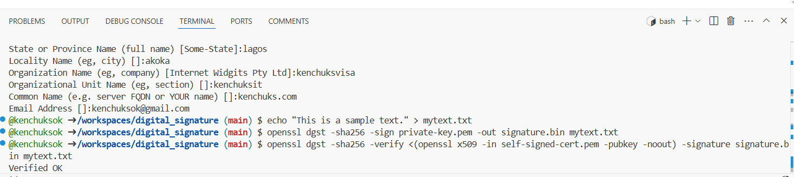

# digital_signature

# steps 
1. Generate the Private Key with the below command:
openssl genpkey -algorithm RSA -out private-key.pem

2. Generate a Self-Signed Certificate: with the below command
openssl req -new -x509 -key private-key.pem -out self-signed-cert.pem -days 365

after the above command, fill in the necessary information when prompted.

Country Name (2 letter code) [AU]:ng
State or Province Name (full name) [Some-State]:lagos
Locality Name (eg, city) []:akoka
Organization Name (eg, company) [Internet Widgits Pty Ltd]:kenchuksvisa
Organizational Unit Name (eg, section) []:kenchuksit
Common Name (e.g. server FQDN or YOUR name) []:kenchuks.com
Email Address []:kenchuksok@gmail.com

3. Create a Text File for Signing:
I Created a file named mytext.txt with some content in it as a text file
echo "This is a sample text." > mytext.txt

4. Generate a Hash of the File and Sign it:
openssl dgst -sha256 -sign private-key.pem -out signature.bin mytext.txt

5 Verify the Signature:
openssl dgst -sha256 -verify <(openssl x509 -in self-signed-cert.pem -pubkey -noout) -signature signature.bin mytext.txt

